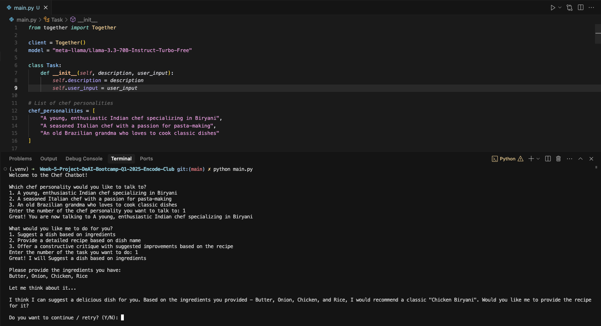
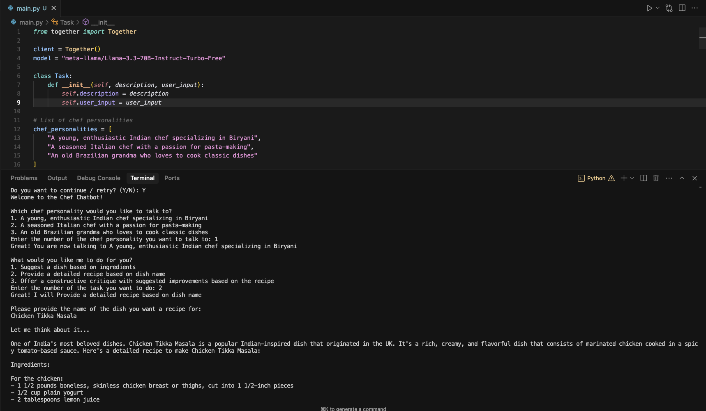

# Week 5 Project - AI GPT Bootcamp Q4 2024 - Encode Club

This project is an evolution of the [Week 1 Project](https://github.com/ifanzalukhu97/Week-1-Project-DeAI-Bootcamp-Q1-2025-Encode-Club). In Week 5, we've made significant modifications to enhance the project's decentralization and blockchain integration:

1. Replaced OpenAI APIs with decentralized inference using Together AI for a more decentralized approach to AI implementation
2. Implementing smart contracts to handle payments and other relevant assets for the Chef GPT system
3. Integration of Web3 capabilities to create a more decentralized and transparent AI service

## Project Description

This project involves developing a decentralized Chef GPT Script with unique personalities that can:
- Give delicious dish ideas based on ingredients.
- Provide recipes for the dishes.
- Offer tips or critiques based on the ingredients.

Each script features a distinct AI chef personality, now powered by decentralized AI inference. The system includes:
1. **Ingredient-based Dish Suggestions**: Suggests dish names based on provided ingredients.
2. **Recipe Requests for Specific Dishes**: Provides detailed recipes for requested dishes.
3. **Recipe Critiques and Improvement Suggestions**: Offers constructive critiques and improvement suggestions for provided recipes.
4. **Smart Contract Integration**: Handles payments and transactions in a decentralized manner.

## Prerequisites
Before you begin, ensure you have met the following requirements:
- You have installed Python 3.8 or later.
- You have installed pip (Python package installer).
- You have set up your Together AI API key (Sign up at https://api.together.ai/signin).
- Make sure that the Together AI API key is stored in an environment variable named exactly `TOGETHER_API_KEY`. For detailed instructions, visit https://docs.together.ai/docs/quickstart.

## How to Run

Follow these steps to run the project:

1. **Clone the Repository**:
    ```sh
    git https://github.com/ifanzalukhu97/Week-5-Project-DeAI-Bootcamp-Q1-2025-Encode-Club.git
    cd Week-5-Project-DeAI-Bootcamp-Q1-2025-Encode-Club
    ```

2. **Create a Virtual Environment**:
    ```sh
    python -m venv .venv
    ```

3. **Activate the Virtual Environment**:
    - On macOS and Linux:
        ```sh
        source .venv/bin/activate
        ```
    - On Windows:
        ```sh
        .\venv\Scripts\activate
        ```

4. **Install the Required Packages**:
    ```sh
    pip install -r requirements.txt
    ```
5. **Set your account's API key to an environment variable**:
    ```sh
    export TOGETHER_API_KEY=xxxxx
    ```

6. **Run the Script**:
    ```sh
    python main.py
    ```

## Simple Report




## Contributors
- [ifanzalukhu97](https://github.com/ifanzalukhu97) (Unique ID: S3lFve)
- [joyjsmun](https://github.com/ifanzalukhu97) (Unique ID: OFVwFA)